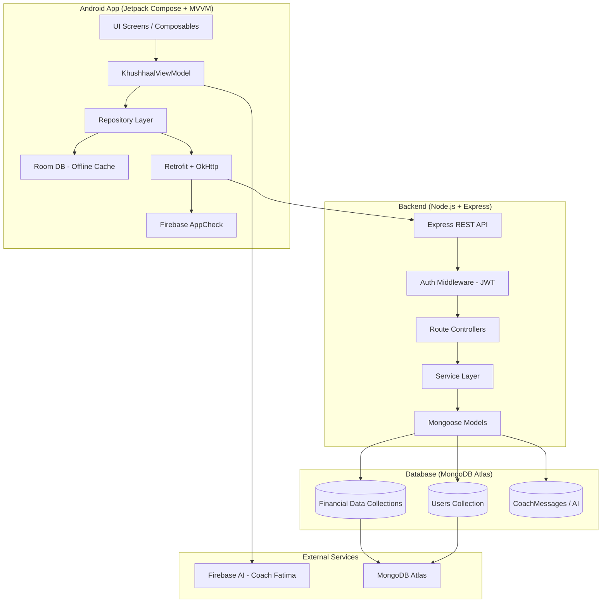
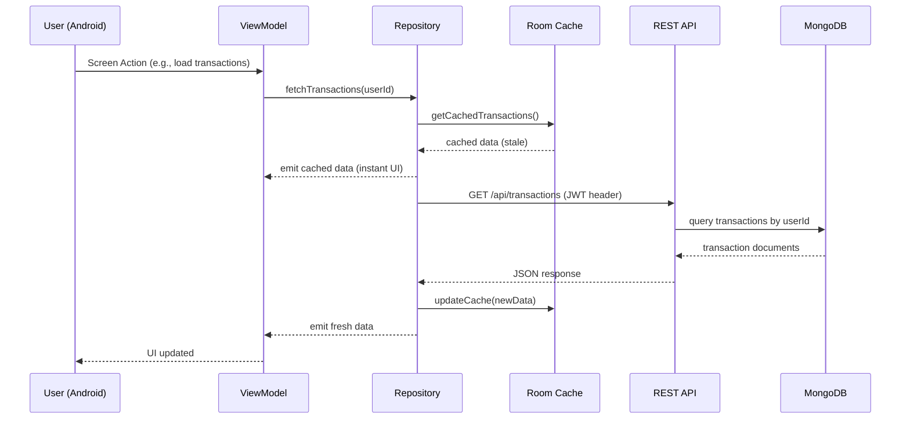

# Design Document: Khushhaal Backend Integration

## Overview

Khushhaal ek bilingual (Urdu/English) financial wellness app hai jo Pakistani factory workers ke liye bani hai. Is waqt app 100% static/mockup hai — sab data ViewModel mein hardcoded hai. Is feature ka maqsad ek complete backend system banana hai: Node.js + Express REST API, MongoDB database, JWT authentication, aur Android ke existing Retrofit/OkHttp infrastructure ko activate karna taake har user ka apna personalized data ho.

Backend architecture ek RESTful API server par based hogi jo MongoDB mein per-user data store karega. Android app ka `KhushhaalViewModel` ek Repository layer ke zariye API se baat karega, aur local Room database offline caching ke liye use hogi. Authentication JWT tokens se hogi, jo Firebase AppCheck ke saath integrate honge for extra security.

Is integration ke baad app ka har screen — Home, Money, Prosperity, Goals, Transactions, sab — real user data dikhayega. Ek user (Ahmed Bhai) ki jagah har registered factory worker apna unique profile, transactions, aur financial plan dekhega.

---

## Architecture

### High-Level System Architecture



### Data Flow Diagram



---

## Components and Interfaces

### Component 1: Authentication System

**Purpose**: User registration, login, JWT token management, aur secure logout

**Interface** (Retrofit API Service):
```kotlin
interface AuthApiService {
    @POST("api/auth/register")
    suspend fun register(@Body request: RegisterRequest): Response<AuthResponse>

    @POST("api/auth/login")
    suspend fun login(@Body request: LoginRequest): Response<AuthResponse>

    @POST("api/auth/refresh")
    suspend fun refreshToken(@Body request: RefreshTokenRequest): Response<AuthResponse>

    @POST("api/auth/logout")
    suspend fun logout(@Header("Authorization") token: String): Response<Unit>
}

data class RegisterRequest(
    val name: String,
    val cnic: String,          // "42101-1234567-3"
    val phone: String,         // "+923001234567"
    val factory: String,       // "Naveena Mills Unit 4"
    val factoryId: String,     // "NVM-4892"
    val jazzCashNumber: String,
    val password: String,
    val preferredLanguage: String  // "BILINGUAL" | "URDU" | "ENGLISH"
)

data class LoginRequest(
    val phone: String,
    val password: String
)

data class AuthResponse(
    val accessToken: String,
    val refreshToken: String,
    val user: UserProfileDto
)
```

**Responsibilities**:
- CNIC + phone number based unique user identification
- JWT access token (15 min expiry) + refresh token (30 days)
- Token storage in Android EncryptedSharedPreferences
- Auto-refresh on 401 response via OkHttp Interceptor

---

### Component 2: API Service Layer (Android)

**Purpose**: All backend endpoints ka Retrofit interface, grouped by domain

```kotlin
interface KhushhaalApiService {
    // --- User Profile ---
    @GET("api/users/me")
    suspend fun getProfile(@Header("Authorization") token: String): Response<UserProfileDto>

    @PUT("api/users/me")
    suspend fun updateProfile(
        @Header("Authorization") token: String,
        @Body update: UpdateProfileRequest
    ): Response<UserProfileDto>

    // --- Cash Flow ---
    @GET("api/cashflow/current")
    suspend fun getCashFlow(@Header("Authorization") token: String): Response<CashFlowDto>

    @PUT("api/cashflow/current")
    suspend fun updateCashFlow(
        @Header("Authorization") token: String,
        @Body update: UpdateCashFlowRequest
    ): Response<CashFlowDto>

    // --- Transactions ---
    @GET("api/transactions")
    suspend fun getTransactions(
        @Header("Authorization") token: String,
        @Query("month") month: String? = null,
        @Query("page") page: Int = 1
    ): Response<PagedResponse<TransactionDto>>

    @POST("api/transactions")
    suspend fun addTransaction(
        @Header("Authorization") token: String,
        @Body transaction: CreateTransactionRequest
    ): Response<TransactionDto>

    // --- Envelopes ---
    @GET("api/envelopes")
    suspend fun getEnvelopes(@Header("Authorization") token: String): Response<List<EnvelopeDto>>

    @PUT("api/envelopes/{id}")
    suspend fun updateEnvelope(
        @Header("Authorization") token: String,
        @Path("id") envelopeId: String,
        @Body update: UpdateEnvelopeRequest
    ): Response<EnvelopeDto>

    // --- Kametis ---
    @GET("api/kametis")
    suspend fun getKametis(@Header("Authorization") token: String): Response<List<KametiDto>>

    @POST("api/kametis")
    suspend fun addKameti(
        @Header("Authorization") token: String,
        @Body kameti: CreateKametiRequest
    ): Response<KametiDto>

    @PUT("api/kametis/{id}/pay")
    suspend fun markKametiPaid(
        @Header("Authorization") token: String,
        @Path("id") kametiId: String
    ): Response<KametiDto>

    // --- Family Goals ---
    @GET("api/goals")
    suspend fun getGoals(@Header("Authorization") token: String): Response<List<GoalDto>>

    @POST("api/goals")
    suspend fun addGoal(
        @Header("Authorization") token: String,
        @Body goal: CreateGoalRequest
    ): Response<GoalDto>

    @PUT("api/goals/{id}/contribute")
    suspend fun contributeToGoal(
        @Header("Authorization") token: String,
        @Path("id") goalId: String,
        @Body contribution: ContributeRequest
    ): Response<GoalDto>

    // --- Debts ---
    @GET("api/debts")
    suspend fun getDebts(@Header("Authorization") token: String): Response<List<DebtDto>>

    @POST("api/debts")
    suspend fun addDebt(
        @Header("Authorization") token: String,
        @Body debt: CreateDebtRequest
    ): Response<DebtDto>

    @PUT("api/debts/{id}/repay")
    suspend fun repayDebt(
        @Header("Authorization") token: String,
        @Path("id") debtId: String,
        @Body repayment: RepayRequest
    ): Response<DebtDto>

    // --- Utility Bills ---
    @GET("api/bills")
    suspend fun getBills(@Header("Authorization") token: String): Response<List<BillDto>>

    @POST("api/bills")
    suspend fun addBill(
        @Header("Authorization") token: String,
        @Body bill: CreateBillRequest
    ): Response<BillDto>

    @PUT("api/bills/{id}/pay")
    suspend fun markBillPaid(
        @Header("Authorization") token: String,
        @Path("id") billId: String
    ): Response<BillDto>

    // --- Emergency Locker ---
    @GET("api/emergency-locker")
    suspend fun getLockerBalance(@Header("Authorization") token: String): Response<LockerDto>

    @POST("api/emergency-locker/deposit")
    suspend fun depositToLocker(
        @Header("Authorization") token: String,
        @Body req: LockerTransactionRequest
    ): Response<LockerDto>

    @POST("api/emergency-locker/withdraw")
    suspend fun withdrawFromLocker(
        @Header("Authorization") token: String,
        @Body req: LockerTransactionRequest
    ): Response<LockerDto>

    // --- Business Khata (Customer Orders) ---
    @GET("api/orders")
    suspend fun getOrders(@Header("Authorization") token: String): Response<List<OrderDto>>

    @POST("api/orders")
    suspend fun addOrder(
        @Header("Authorization") token: String,
        @Body order: CreateOrderRequest
    ): Response<OrderDto>

    @PUT("api/orders/{id}")
    suspend fun updateOrder(
        @Header("Authorization") token: String,
        @Path("id") orderId: String,
        @Body update: UpdateOrderRequest
    ): Response<OrderDto>

    // --- Prosperity Score ---
    @GET("api/prosperity")
    suspend fun getProsperity(@Header("Authorization") token: String): Response<ProsperityDto>

    // --- Notifications ---
    @GET("api/notifications")
    suspend fun getNotifications(@Header("Authorization") token: String): Response<List<NotificationDto>>

    @PUT("api/notifications/{id}/read")
    suspend fun markNotificationRead(
        @Header("Authorization") token: String,
        @Path("id") notifId: String
    ): Response<Unit>

    @DELETE("api/notifications")
    suspend fun clearNotifications(@Header("Authorization") token: String): Response<Unit>

    // --- Coach Messages ---
    @GET("api/coach/messages")
    suspend fun getCoachMessages(@Header("Authorization") token: String): Response<List<CoachMessageDto>>

    @POST("api/coach/messages")
    suspend fun sendCoachMessage(
        @Header("Authorization") token: String,
        @Body message: SendMessageRequest
    ): Response<CoachMessageDto>
}
```

**Responsibilities**:
- All user data endpoints (authenticated via JWT Bearer token)
- Suspend functions for Kotlin coroutines
- Response<T> wrapping for HTTP error handling
- Query params for pagination/filtering

---

### Component 3: Repository Layer (Android)

**Purpose**: ViewModel aur data sources (API + Room cache) ke beech bridge

```kotlin
// Base sealed class for network state
sealed class Result<out T> {
    data class Success<T>(val data: T) : Result<T>()
    data class Error(val code: Int, val message: String) : Result<Nothing>()
    object Loading : Result<Nothing>()
}

interface KhushhaalRepository {
    // Emits cached data first, then fresh from API
    fun getTransactions(month: String? = null): Flow<Result<List<TransactionItem>>>
    fun getEnvelopes(): Flow<Result<List<Envelope>>>
    fun getKametis(): Flow<Result<List<KametiItem>>>
    fun getGoals(): Flow<Result<List<FamilyGoalItem>>>
    fun getDebts(): Flow<Result<List<DebtItem>>>
    fun getBills(): Flow<Result<List<UtilityBill>>>
    fun getEmergencyLockerBalance(): Flow<Result<Long>>
    fun getCustomerOrders(): Flow<Result<List<CustomerOrder>>>
    fun getProsperityScore(): Flow<Result<ProsperityScore>>
    fun getNotifications(): Flow<Result<List<AppNotification>>>

    // Mutations (suspend, single-shot)
    suspend fun addTransaction(request: CreateTransactionRequest): Result<TransactionItem>
    suspend fun contributeToGoal(goalId: String, amount: Long): Result<FamilyGoalItem>
    suspend fun markKametiPaid(kametiId: String): Result<KametiItem>
    suspend fun repayDebt(debtId: String, amount: Long): Result<DebtItem>
    suspend fun depositToLocker(amount: Long): Result<Long>
    suspend fun withdrawFromLocker(amount: Long): Result<Long>
    suspend fun markBillPaid(billId: String): Result<UtilityBill>
}
```

**Responsibilities**:
- Cache-first strategy: Room data emit karo, phir API se refresh
- Offline support: agar network nahi, Room se data serve karo
- Error mapping: HTTP errors ko user-friendly Urdu/English messages mein convert
- Token injection from TokenManager

---

### Component 4: Express REST API (Backend)

**Purpose**: All business logic, data persistence, aur authentication

**Directory Structure**:
```
backend/
├── src/
│   ├── config/
│   │   ├── db.js           # MongoDB connection
│   │   └── env.js          # Environment variables
│   ├── middleware/
│   │   ├── auth.js         # JWT verification middleware
│   │   └── appcheck.js     # Firebase AppCheck verification
│   ├── models/             # Mongoose schemas
│   ├── controllers/        # Request handlers
│   ├── routes/             # Express route definitions
│   ├── services/           # Business logic
│   └── app.js              # Express app setup
├── package.json
└── .env
```

**Responsibilities**:
- JWT token issuance, refresh, revocation
- Per-user data isolation (every query filters by userId)
- Input validation via express-validator
- Prosperity Score calculation engine
- Coach AI message relay via Firebase AI

---

## Data Models

### MongoDB Schemas

#### User Schema

```javascript
const UserSchema = new mongoose.Schema({
    name: { type: String, required: true },
    urduName: { type: String },
    phone: { type: String, required: true, unique: true }, // "+923001234567"
    cnic: { type: String, required: true, unique: true },  // "42101-1234567-3"
    passwordHash: { type: String, required: true },
    factory: { type: String, required: true },
    factoryId: { type: String },
    jazzCashNumber: { type: String },
    avatarUrl: { type: String },
    preferredLanguage: { 
        type: String, 
        enum: ['BILINGUAL', 'URDU', 'ENGLISH'], 
        default: 'BILINGUAL' 
    },
    refreshTokenHash: { type: String },
    isActive: { type: Boolean, default: true },
    createdAt: { type: Date, default: Date.now },
    lastLoginAt: { type: Date }
});
```

**Validation Rules**:
- `phone`: Pakistani format, unique
- `cnic`: Format `DDDDD-DDDDDDD-D`, unique
- `password`: min 8 chars, hashed with bcrypt (rounds: 12)

---

#### CashFlow Schema

```javascript
const CashFlowSchema = new mongoose.Schema({
    userId: { type: mongoose.Schema.Types.ObjectId, ref: 'User', required: true, index: true },
    month: { type: String, required: true },  // "2025-03" (YYYY-MM)
    income: { type: Number, required: true, min: 0 },
    incomeLabel: { type: String },
    expenses: { type: Number, default: 0 },
    expensesLabel: { type: String },
    savings: { type: Number, default: 0 },
    available: { type: Number, default: 0 },
    updatedAt: { type: Date, default: Date.now }
});
CashFlowSchema.index({ userId: 1, month: -1 });
```

---

#### Transaction Schema

```javascript
const TransactionSchema = new mongoose.Schema({
    userId: { type: mongoose.Schema.Types.ObjectId, ref: 'User', required: true, index: true },
    title: { type: String, required: true },
    urduTitle: { type: String },
    amount: { type: Number, required: true, min: 1 },
    isExpense: { type: Boolean, required: true },
    category: { type: String, required: true },
    envelopeId: { type: String },
    paymentMethod: { type: String },
    date: { type: Date, default: Date.now }
});
TransactionSchema.index({ userId: 1, date: -1 });
```

---

#### Envelope Schema

```javascript
const EnvelopeSchema = new mongoose.Schema({
    userId: { type: mongoose.Schema.Types.ObjectId, ref: 'User', required: true, index: true },
    envelopeKey: { type: String, required: true }, // "needs", "commitments", "emergency", "savings"
    titleEnglish: { type: String, required: true },
    titleUrdu: { type: String },
    percentage: { type: Number, min: 0, max: 100 },
    amount: { type: Number, default: 0 },
    tag: { type: String },
    items: [{
        label: String,
        amount: Number
    }],
    updatedAt: { type: Date, default: Date.now }
});
EnvelopeSchema.index({ userId: 1, envelopeKey: 1 }, { unique: true });
```

---

#### KametiItem Schema

```javascript
const KametiSchema = new mongoose.Schema({
    userId: { type: mongoose.Schema.Types.ObjectId, ref: 'User', required: true, index: true },
    name: { type: String, required: true },
    urduName: { type: String },
    monthlyAmount: { type: Number, required: true, min: 1 },
    totalMembers: { type: Number, required: true, min: 2 },
    myTurnMonth: { type: Number, required: true },
    currentMonth: { type: Number, required: true },
    payoutAmount: { type: Number },
    organizer: { type: String },
    isPaidThisMonth: { type: Boolean, default: false },
    createdAt: { type: Date, default: Date.now }
});
```

---

#### FamilyGoal Schema

```javascript
const GoalSchema = new mongoose.Schema({
    userId: { type: mongoose.Schema.Types.ObjectId, ref: 'User', required: true, index: true },
    title: { type: String, required: true },
    urduTitle: { type: String },
    targetAmount: { type: Number, required: true, min: 1 },
    currentAmount: { type: Number, default: 0 },
    targetDate: { type: String },  // "Nov 2025"
    emoji: { type: String, default: '🎯' },
    isCompleted: { type: Boolean, default: false },
    createdAt: { type: Date, default: Date.now }
});
```

---

#### DebtItem Schema

```javascript
const DebtSchema = new mongoose.Schema({
    userId: { type: mongoose.Schema.Types.ObjectId, ref: 'User', required: true, index: true },
    creditorName: { type: String, required: true },
    creditorUrdu: { type: String },
    relationOrType: { type: String },
    totalAmount: { type: Number, required: true, min: 1 },
    remainingAmount: { type: Number, required: true },
    monthlyCommitment: { type: Number, default: 0 },
    urgencyLevel: { type: String },
    isShariahFriendly: { type: Boolean, default: true },
    repaymentStrategyTip: { type: String },
    createdAt: { type: Date, default: Date.now }
});
```

---

#### UtilityBill Schema

```javascript
const BillSchema = new mongoose.Schema({
    userId: { type: mongoose.Schema.Types.ObjectId, ref: 'User', required: true, index: true },
    companyName: { type: String, required: true },
    companyUrdu: { type: String },
    consumerNumber: { type: String },
    billType: { type: String },
    month: { type: String },
    dueDate: { type: String },
    amount: { type: Number, required: true, min: 1 },
    unitsConsumed: { type: Number, default: 0 },
    isPaid: { type: Boolean, default: false },
    paidDate: { type: String },
    alertTip: { type: String },
    createdAt: { type: Date, default: Date.now }
});
```

---

#### CustomerOrder Schema

```javascript
const OrderSchema = new mongoose.Schema({
    userId: { type: mongoose.Schema.Types.ObjectId, ref: 'User', required: true, index: true },
    customerName: { type: String, required: true },
    phone: { type: String },
    serviceTitle: { type: String, required: true },
    totalAmount: { type: Number, required: true, min: 1 },
    advancePaid: { type: Number, default: 0 },
    dueDate: { type: String },
    isDelivered: { type: Boolean, default: false },
    isFullyPaid: { type: Boolean, default: false },
    createdAt: { type: Date, default: Date.now }
});
```

---

#### EmergencyLocker Schema

```javascript
const LockerSchema = new mongoose.Schema({
    userId: { type: mongoose.Schema.Types.ObjectId, ref: 'User', required: true, unique: true },
    balance: { type: Number, default: 0, min: 0 },
    updatedAt: { type: Date, default: Date.now }
});
```

---

#### Notification Schema

```javascript
const NotificationSchema = new mongoose.Schema({
    userId: { type: mongoose.Schema.Types.ObjectId, ref: 'User', required: true, index: true },
    titleUrdu: { type: String, required: true },
    titleEnglish: { type: String, required: true },
    descriptionUrdu: { type: String },
    descriptionEnglish: { type: String },
    category: { type: String, enum: ['FACTORY', 'FINANCE', 'SECURITY', 'COACH'] },
    isRead: { type: Boolean, default: false },
    destination: { type: String },  // AppDestination serialized name
    spokenText: { type: String },
    createdAt: { type: Date, default: Date.now }
});
NotificationSchema.index({ userId: 1, createdAt: -1 });
```

---

#### CoachMessage Schema

```javascript
const CoachMessageSchema = new mongoose.Schema({
    userId: { type: mongoose.Schema.Types.ObjectId, ref: 'User', required: true, index: true },
    textUrdu: { type: String, required: true },
    textRoman: { type: String },
    isFromCoach: { type: Boolean, required: true },
    spokenText: { type: String },
    createdAt: { type: Date, default: Date.now }
});
CoachMessageSchema.index({ userId: 1, createdAt: 1 });
```

---

#### ProsperityScore Schema

```javascript
const ProsperitySchema = new mongoose.Schema({
    userId: { type: mongoose.Schema.Types.ObjectId, ref: 'User', required: true, unique: true },
    score: { type: Number, default: 0 },
    maxScore: { type: Number, default: 100 },
    savingsPct: { type: Number, default: 0 },
    debtControlPct: { type: Number, default: 0 },
    safetyShieldPct: { type: Number, default: 0 },
    daysRunway: { type: Number, default: 0 },
    pillars: [{
        id: Number,
        titleEnglish: String,
        titleUrdu: String,
        weightPercent: Number,
        currentScore: Number,
        maxScore: Number,
        statusText: String,
        statusColorType: { type: String, enum: ['SUCCESS', 'WARNING', 'URGENT'] }
    }],
    lastCalculatedAt: { type: Date, default: Date.now }
});
```

---

## Algorithmic Pseudocode

### Authentication Flow

```pascal
ALGORITHM register(registrationData)
INPUT: name, cnic, phone, factory, factoryId, jazzCash, password
OUTPUT: AuthResponse (accessToken, refreshToken, userProfile)

BEGIN
  ASSERT isValidCNIC(registrationData.cnic) = true
  ASSERT isValidPakistaniPhone(registrationData.phone) = true
  ASSERT password.length >= 8

  existingUser ← database.users.findOne({ phone: registrationData.phone })
  IF existingUser IS NOT NULL THEN
    RETURN Error(409, "Phone number already registered / نمبر پہلے سے رجسٹرڈ ہے")
  END IF

  cnicUser ← database.users.findOne({ cnic: registrationData.cnic })
  IF cnicUser IS NOT NULL THEN
    RETURN Error(409, "CNIC already registered / شناختی کارڈ پہلے سے موجود ہے")
  END IF

  passwordHash ← bcrypt.hash(registrationData.password, 12)
  newUser ← database.users.create({ ...registrationData, passwordHash })
  
  // Seed default data for new user
  CALL seedUserDefaults(newUser._id)

  accessToken ← jwt.sign({ userId: newUser._id }, JWT_SECRET, { expiresIn: "15m" })
  refreshToken ← jwt.sign({ userId: newUser._id }, REFRESH_SECRET, { expiresIn: "30d" })
  
  newUser.refreshTokenHash ← bcrypt.hash(refreshToken, 10)
  CALL database.users.save(newUser)

  RETURN { accessToken, refreshToken, user: toProfileDto(newUser) }
END
```

```pascal
ALGORITHM login(credentials)
INPUT: phone, password
OUTPUT: AuthResponse (accessToken, refreshToken, userProfile)

BEGIN
  ASSERT credentials.phone IS NOT EMPTY
  ASSERT credentials.password IS NOT EMPTY

  user ← database.users.findOne({ phone: credentials.phone })
  IF user IS NULL THEN
    RETURN Error(401, "غلط نمبر یا پاسورڈ / Invalid credentials")
  END IF

  isPasswordValid ← bcrypt.compare(credentials.password, user.passwordHash)
  IF isPasswordValid = false THEN
    RETURN Error(401, "غلط نمبر یا پاسورڈ / Invalid credentials")
  END IF

  accessToken ← jwt.sign({ userId: user._id }, JWT_SECRET, { expiresIn: "15m" })
  refreshToken ← jwt.sign({ userId: user._id }, REFRESH_SECRET, { expiresIn: "30d" })
  
  user.refreshTokenHash ← bcrypt.hash(refreshToken, 10)
  user.lastLoginAt ← Date.now()
  CALL database.users.save(user)

  RETURN { accessToken, refreshToken, user: toProfileDto(user) }
END
```

---

### Prosperity Score Calculation

```pascal
ALGORITHM calculateProsperityScore(userId)
INPUT: userId
OUTPUT: ProsperityScore with pillars

BEGIN
  cashFlow ← database.cashflow.findLatest(userId)
  emergencyLocker ← database.lockers.findOne(userId)
  debts ← database.debts.find({ userId })
  transactions ← database.transactions.findByMonth(userId, currentMonth)
  kametis ← database.kametis.find({ userId })
  goals ← database.goals.find({ userId })

  // Pillar 1: Budgeting (Weight: 20)
  hasTransactionsThisMonth ← transactions.count > 3
  pillar1Score ← IF hasTransactionsThisMonth THEN 16 ELSE 8

  // Pillar 2: Savings Habit (Weight: 20)
  totalKametiSavings ← SUM(kametis.monthlyAmount)
  savingsRate ← totalKametiSavings / cashFlow.income
  pillar2Score ← MIN(20, FLOOR(savingsRate * 100))

  // Pillar 3: Emergency Buffer (Weight: 20)
  dailyExpenses ← cashFlow.expenses / 30
  IF dailyExpenses > 0 THEN
    daysRunway ← FLOOR(emergencyLocker.balance / dailyExpenses)
  ELSE
    daysRunway ← 0
  END IF
  pillar3Score ← MIN(20, FLOOR(daysRunway / 30 * 20))

  // Pillar 4: Debt Control (Weight: 15)
  totalDebt ← SUM(debts.remainingAmount)
  debtToIncomeRatio ← totalDebt / cashFlow.income
  IF debtToIncomeRatio < 1 THEN
    pillar4Score ← 12
  ELSE IF debtToIncomeRatio < 3 THEN
    pillar4Score ← 8
  ELSE
    pillar4Score ← 3
  END IF

  // Pillar 5: Digital Safety (Weight: 10) - static, based on academy completion
  pillar5Score ← 9  // Updated via FraudAcademy progress

  // Pillar 6: Income Resilience (Weight: 15)
  activeGoals ← goals.filter(g => NOT g.isCompleted).count
  pillar6Score ← MIN(15, activeGoals * 3)

  totalScore ← pillar1Score + pillar2Score + pillar3Score + pillar4Score + pillar5Score + pillar6Score

  ASSERT totalScore >= 0 AND totalScore <= 100

  CALL database.prosperity.upsert(userId, {
    score: totalScore,
    daysRunway: daysRunway,
    pillars: [pillar1, pillar2, pillar3, pillar4, pillar5, pillar6],
    lastCalculatedAt: Date.now()
  })

  RETURN prosperityDto
END
```

---

### Repository Cache-First Strategy (Android)

```pascal
ALGORITHM fetchWithCache(apiCall, roomQuery, roomUpdate)
INPUT: apiCall (suspend lambda), roomQuery (Flow<T>), roomUpdate (suspend lambda)
OUTPUT: Flow<Result<T>>

BEGIN
  // Immediately emit cached data
  EMIT Loading
  cachedData ← roomQuery.first()
  IF cachedData IS NOT EMPTY THEN
    EMIT Success(cachedData)
  END IF

  // Fetch fresh data from API
  TRY
    apiResponse ← CALL apiCall()
    IF apiResponse.isSuccessful THEN
      freshData ← apiResponse.body()
      CALL roomUpdate(freshData)
      EMIT Success(freshData)
    ELSE IF apiResponse.code = 401 THEN
      CALL tokenManager.refreshToken()
      RETRY apiCall once
    ELSE
      EMIT Error(apiResponse.code, apiResponse.errorMessage)
    END IF
  CATCH NetworkException
    IF cachedData IS EMPTY THEN
      EMIT Error(0, "انٹرنیٹ کنیکشن نہیں / No internet connection")
    END IF
    // If cached data was emitted, silently fail - user sees cached data
  END TRY
END
```

---

### New User Data Seeding

```pascal
ALGORITHM seedUserDefaults(userId)
INPUT: userId (newly registered user)
OUTPUT: void (side effect: default documents created in DB)

BEGIN
  // Create default envelopes (Pakistani budget allocation)
  CALL database.envelopes.insertMany([
    { userId, envelopeKey: "needs",       percentage: 70, titleEnglish: "Household Needs",    titleUrdu: "ضروری اخراجات" },
    { userId, envelopeKey: "commitments", percentage: 6,  titleEnglish: "Commitments",         titleUrdu: "کمیٹی و واجبات" },
    { userId, envelopeKey: "emergency",   percentage: 6,  titleEnglish: "Emergency Fund",      titleUrdu: "ہنگامی تحفظ" },
    { userId, envelopeKey: "savings",     percentage: 18, titleEnglish: "Savings & Buffer",    titleUrdu: "دستیاب بچت" }
  ])

  // Create empty emergency locker
  CALL database.lockers.create({ userId, balance: 0 })

  // Create empty prosperity score
  CALL database.prosperity.create({ userId, score: 0 })

  // Create welcome coach message
  CALL database.coachMessages.create({
    userId,
    textUrdu: "السلام علیکم! میں آپ کی مالیاتی کوچ فاطمہ ہوں۔ شروع کرنے کے لیے اپنی ماہانہ تنخواہ درج کریں۔",
    textRoman: "Assalam-o-Alaikum! Main aap ki maliyati coach Fatima hoon. Shuru karne ke liye apni maahana tankhaah darj karein.",
    isFromCoach: true,
    spokenText: "Assalam-o-Alaikum! I am your financial coach Fatima."
  })

  ASSERT database.envelopes.count({ userId }) = 4
  ASSERT database.lockers.findOne({ userId }) IS NOT NULL
END
```

---

## Key Functions with Formal Specifications

### JWT Auth Middleware (Express)

```javascript
function authMiddleware(req, res, next)
```

**Preconditions**:
- `req.headers.authorization` exists and starts with "Bearer "
- JWT_SECRET environment variable is set

**Postconditions**:
- If valid: `req.userId` is set to authenticated user's ObjectId, `next()` is called
- If invalid/expired: responds with `401 { error: "Unauthorized" }`, `next()` NOT called
- If token expired: responds with `401 { error: "Token expired", code: "TOKEN_EXPIRED" }` for client refresh logic

**Loop Invariants**: N/A (no loops)

---

### OkHttp Token Interceptor (Android)

```kotlin
class AuthInterceptor(private val tokenManager: TokenManager) : Interceptor
```

**Preconditions**:
- `TokenManager` has been initialized with stored tokens
- Request is to a protected endpoint (not `/auth/login` or `/auth/register`)

**Postconditions**:
- Access token is injected into `Authorization` header as `Bearer <token>`
- If 401 received: token refresh is attempted once
- If refresh succeeds: original request is retried with new token
- If refresh fails: user is logged out (tokens cleared, login screen shown)

**Loop Invariants**:
- Refresh retry attempted at most once per original request

---

### Envelope Amount Calculation

```kotlin
fun calculateEnvelopeAmounts(totalIncome: Long, envelopes: List<Envelope>): List<Envelope>
```

**Preconditions**:
- `totalIncome > 0`
- `envelopes` is non-empty
- Sum of `envelope.percentage` values equals 100

**Postconditions**:
- Each returned envelope has `amount = floor(totalIncome * percentage / 100)`
- Sum of all returned envelope amounts <= totalIncome (rounding down)
- Input envelope list is not mutated

**Loop Invariants**:
- For each processed envelope: `amount >= 0` and `amount <= totalIncome`

---

## Example Usage

### Android: Adding a Transaction

```kotlin
// In KhushhaalViewModel
fun logQuickExpense(title: String, amount: Long) {
    viewModelScope.launch {
        val request = CreateTransactionRequest(
            title = title,
            urduTitle = title,
            amount = amount,
            isExpense = true,
            category = "Needs",
            envelopeId = "needs",
            paymentMethod = "Cash"
        )
        when (val result = repository.addTransaction(request)) {
            is Result.Success -> {
                // Room cache automatically updated
                showToast("خرچ درج ہو گیا / Expense logged")
            }
            is Result.Error -> {
                showToast("خرابی: ${result.message}")
            }
            else -> {}
        }
    }
}
```

### Backend: Auth Route

```javascript
// POST /api/auth/login
router.post('/login', async (req, res) => {
    const { phone, password } = req.body;

    const user = await User.findOne({ phone });
    if (!user) return res.status(401).json({ error: 'Invalid credentials' });

    const isValid = await bcrypt.compare(password, user.passwordHash);
    if (!isValid) return res.status(401).json({ error: 'Invalid credentials' });

    const accessToken = jwt.sign({ userId: user._id }, process.env.JWT_SECRET, { expiresIn: '15m' });
    const refreshToken = jwt.sign({ userId: user._id }, process.env.REFRESH_SECRET, { expiresIn: '30d' });

    user.refreshTokenHash = await bcrypt.hash(refreshToken, 10);
    user.lastLoginAt = new Date();
    await user.save();

    res.json({ accessToken, refreshToken, user: toProfileDto(user) });
});
```

### Backend: Protected Transactions Route

```javascript
// GET /api/transactions (protected)
router.get('/', authMiddleware, async (req, res) => {
    const { month, page = 1 } = req.query;
    const limit = 20;
    
    const query = { userId: req.userId };
    if (month) {
        const start = new Date(`${month}-01`);
        const end = new Date(start.getFullYear(), start.getMonth() + 1, 0);
        query.date = { $gte: start, $lte: end };
    }

    const total = await Transaction.countDocuments(query);
    const items = await Transaction.find(query)
        .sort({ date: -1 })
        .skip((page - 1) * limit)
        .limit(limit);

    res.json({ items, total, page, pages: Math.ceil(total / limit) });
});
```

---

## Correctness Properties

*A property is a characteristic or behavior that should hold true across all valid executions of a system — essentially, a formal statement about what the system should do. Properties serve as the bridge between human-readable specifications and machine-verifiable correctness guarantees.*

### Property 1: Registration input validation rejects malformed identifiers

*For any* string that does not match the CNIC format `DDDDD-DDDDDDD-D`, the registration endpoint SHALL return HTTP 400 and reject the request.

**Validates: Requirements 1.2, 1.3, 1.4**

---

### Property 2: Password stored as bcrypt hash, never plaintext

*For any* successfully registered user with password `p`, the stored `passwordHash` SHALL satisfy `bcrypt.compare(p, passwordHash) = true` and `passwordHash ≠ p`.

**Validates: Requirements 1.7, 19.3**

---

### Property 3: New user registration seeds required default records

*For any* new user registration that succeeds, the Auth_Service SHALL create exactly 4 envelope documents (needs, commitments, emergency, savings), 1 Emergency Locker document with balance = 0, 1 Prosperity Score document with score = 0, and 1 welcome coach message with isFromCoach = true.

**Validates: Requirements 1.8, 20.1, 20.2, 20.3, 20.4, 20.5**

---

### Property 4: Login round-trip — register then login succeeds

*For any* user registered with phone `p` and password `pw`, a subsequent login request with the same `p` and `pw` SHALL return a valid access token, refresh token, and user profile DTO.

**Validates: Requirements 2.1, 2.4**

---

### Property 5: Login with wrong password is always rejected

*For any* registered user and *for any* string that does not equal their actual password, a login request with that string SHALL return HTTP 401 with the bilingual error message.

**Validates: Requirements 2.2, 2.3**

---

### Property 6: Refresh token rotation invalidates old token

*For any* valid refresh token `r`, calling the refresh endpoint SHALL return a new pair of tokens and SHALL ensure that a second call with the original `r` returns HTTP 401 (old token is invalidated).

**Validates: Requirements 3.2, 3.3**

---

### Property 7: Protected endpoints reject requests without valid JWT

*For any* protected endpoint path (not in the auth exclusion list), a request without a valid `Authorization: Bearer <token>` header SHALL return HTTP 401.

**Validates: Requirements 4.1, 4.3, 4.4**

---

### Property 8: Per-user data isolation — no cross-user data leakage

*For any* two distinct users A and B, any GET request authenticated as user A on any data collection endpoint (transactions, envelopes, kametis, goals, debts, bills, locker, orders, notifications, coach messages, cash flow) SHALL return zero records that belong to user B.

**Validates: Requirements 4.5, 19.1, 19.2, 19.6**

---

### Property 9: Cash flow upsert round-trip

*For any* valid cash flow update (income, expenses, savings, available), calling `PUT /api/cashflow/current` followed immediately by `GET /api/cashflow/current` SHALL return a record whose values match the values that were PUT.

**Validates: Requirements 6.1, 6.2, 6.3**

---

### Property 10: Transaction month filter returns only matching records

*For any* set of transactions spanning multiple months, querying `GET /api/transactions?month=YYYY-MM` SHALL return only transactions whose `date` falls within that calendar month, and SHALL return zero transactions from any other month.

**Validates: Requirements 7.1, 7.2**

---

### Property 11: Envelope amounts never exceed total income

*For any* total income value `I ≥ 0` and any list of envelopes whose percentages sum to 100, the sum of all computed envelope amounts (`floor(I × pct / 100)`) SHALL be ≤ I. When `I = 0`, all envelope amounts SHALL be 0.

**Validates: Requirements 8.3, 8.4**

---

### Property 12: Goal contribution invariant

*For any* goal and *for any* contribution amount `a > 0`, after the contribution: `goal.currentAmount(after) = goal.currentAmount(before) + a`, and `goal.isCompleted = (currentAmount(after) >= targetAmount)`.

**Validates: Requirements 10.3, 10.4, 10.5**

---

### Property 13: Debt repayment reduces remaining amount exactly

*For any* debt with `remainingAmount = R` and *for any* repayment amount `0 < a ≤ R`, after the repayment: `debt.remainingAmount(after) = R - a`. For any repayment amount `a > R`, the API SHALL return HTTP 400 and leave `remainingAmount` unchanged.

**Validates: Requirements 11.3, 11.4**

---

### Property 14: Emergency locker balance is always non-negative

*For any* sequence of deposit and withdrawal operations on the Emergency Locker, the `locker.balance` SHALL never be stored as a negative number. Any withdrawal that would produce a negative balance SHALL be rejected with HTTP 400.

**Validates: Requirements 13.2, 13.3, 13.4, 13.5**

---

### Property 15: Prosperity Score is bounded in [0, 100]

*For any* combination of user financial data (any income, expense, locker balance, debts, goals, kametis), the Prosperity_Calculator SHALL produce a score `s` where `0 ≤ s ≤ 100`.

**Validates: Requirements 15.2, 15.5**

---

### Property 16: Repository cache-first emission ordering

*For any* data fetch via the Repository, the Repository SHALL emit any non-empty cached Room data before emitting the result of the API call, ensuring UI is never blocked waiting for the network when cached data exists.

**Validates: Requirements 18.1, 18.2, 18.3, 18.4**

---

## Error Handling

### Error Scenario 1: Network Unavailable

**Condition**: Android device has no internet connection when Repository makes API call
**Response**: Repository catches `IOException`, emits `Result.Error(0, "انٹرنیٹ نہیں")` only if no cache available; if cache exists, silently serves cache and shows an offline badge in UI
**Recovery**: Repository observes network state; auto-retries when connectivity restored

### Error Scenario 2: Expired JWT Access Token

**Condition**: API returns `401 { code: "TOKEN_EXPIRED" }`
**Response**: `AuthInterceptor` intercepts response, calls `POST /api/auth/refresh` with stored refreshToken, retries original request with new accessToken
**Recovery**: Transparent to ViewModel/UI; user never sees an error

### Error Scenario 3: Expired Refresh Token (Session Expired)

**Condition**: Refresh token is expired or invalid; `/api/auth/refresh` returns 401
**Response**: `TokenManager.clearTokens()`, `AuthInterceptor` posts `SessionExpired` event to a shared `EventBus`
**Recovery**: ViewModel observes `SessionExpired`, navigates user to Login screen with Urdu message: "سیشن ختم ہو گیا، دوبارہ لاگ ان کریں"

### Error Scenario 4: Duplicate CNIC/Phone on Registration

**Condition**: User tries to register with a phone/CNIC already in DB
**Response**: API returns `409 Conflict` with bilingual error message
**Recovery**: Android shows inline validation error on registration form field

### Error Scenario 5: Withdrawal Exceeds Locker Balance

**Condition**: `POST /api/emergency-locker/withdraw` with amount > locker.balance
**Response**: API returns `400 Bad Request { error: "Insufficient balance / رقم ناکافی ہے" }`
**Recovery**: Android shows toast with Urdu/English error; locker balance unchanged

### Error Scenario 6: MongoDB Connection Failure

**Condition**: Backend cannot reach MongoDB Atlas
**Response**: Express error handler returns `503 Service Unavailable`
**Recovery**: Mongoose auto-reconnects; health check endpoint `/api/health` returns status

---

## Testing Strategy

### Unit Testing Approach

**Backend (Jest)**:
- Auth service: registration validation, password hashing, token generation
- Prosperity calculator: score computation for edge cases (0 income, max debt, etc.)
- Envelope calculation: percentage → amount conversion with rounding
- Input validators: CNIC format, Pakistani phone format

**Android (JUnit + MockK)**:
- Repository: verify cache-first behavior with mocked API responses
- ViewModel: state transitions, error state propagation
- TokenManager: token storage/retrieval/clearing

### Property-Based Testing Approach

**Property Test Library**: fast-check (backend), kotest (Android)

**Backend Properties**:
- `∀ (income: Long where income > 0, percentages summing to 100)` → `sum of envelope amounts ≤ income`
- `∀ (score: Int) output by calculateProsperityScore` → `0 ≤ score ≤ 100`
- `∀ valid JWT token` → `decoded userId exists in database`

**Android Properties**:
- `∀ transaction list t` → `UI renders without crash`
- `∀ (balance: Long ≥ 0, withdrawal: Long ≤ balance)` → `balance after withdrawal ≥ 0`

### Integration Testing Approach

- **API Integration**: Supertest-based tests for all REST endpoints using a test MongoDB instance
- **Auth Flow**: Register → Login → Access protected endpoint → Refresh → Logout
- **Data Isolation**: Two users create same-named records; verify neither can see the other's data
- **Android Instrumentation**: Espresso tests for Login screen, basic navigation with mocked API (MockWebServer)

---

## Performance Considerations

- **Pagination**: All list endpoints (`/api/transactions`, `/api/notifications`) support `page` + `limit` query params (default limit: 20) to avoid large payloads on slow Pakistani mobile networks
- **MongoDB Indexes**: All collections indexed on `userId` + relevant sort field (e.g., `date`, `createdAt`) for fast per-user queries
- **Room Cache**: Android caches all collections locally; most screens load in < 100ms from cache while API refreshes in background
- **JWT Expiry**: Short-lived access tokens (15 min) reduce server-side session storage; refresh tokens are hashed in DB, not stored plaintext
- **Image Optimization**: Avatar URLs are CDN-hosted; app uses Coil with disk caching

---

## Security Considerations

- **Password Hashing**: bcrypt with 12 rounds; plaintext passwords never stored or logged
- **JWT Secrets**: `JWT_SECRET` and `REFRESH_SECRET` are separate, high-entropy environment variables; never committed to git
- **CNIC Masking**: CNIC stored full in DB but sent to Android as masked (`42101-•••••••-3`) to prevent data exposure
- **Firebase AppCheck**: All API calls from Android include AppCheck token; backend middleware validates it to prevent non-app API abuse
- **HTTPS Only**: All API communication via HTTPS; HTTP requests redirected
- **Rate Limiting**: Login endpoint rate-limited (5 attempts per 15 min per IP) via `express-rate-limit`
- **Input Sanitization**: `express-validator` validates and sanitizes all inputs; prevents NoSQL injection (MongoDB `$where` operator disabled)
- **User Isolation**: Every MongoDB query includes `userId: req.userId` filter; no cross-user data access possible
- **Refresh Token Rotation**: On each refresh, old refresh token is invalidated (hash updated in DB)

---

## Dependencies

### Backend

```json
{
  "dependencies": {
    "express": "4.21.2",
    "mongoose": "8.8.0",
    "bcryptjs": "2.4.3",
    "jsonwebtoken": "9.0.2",
    "express-validator": "7.2.0",
    "express-rate-limit": "7.4.0",
    "dotenv": "16.4.5",
    "cors": "2.8.5",
    "helmet": "8.0.0",
    "firebase-admin": "12.7.0"
  },
  "devDependencies": {
    "jest": "29.7.0",
    "supertest": "7.0.0",
    "nodemon": "3.1.7",
    "fast-check": "3.22.0"
  }
}
```

### Android (already in build.gradle.kts — to be activated)

| Library | Purpose | Status |
|---|---|---|
| `retrofit` | REST API calls | Added, unused |
| `okhttp` | HTTP client + interceptors | Added, unused |
| `converter-moshi` | JSON serialization | Added, unused |
| `moshi-kotlin` | JSON parsing | Added, unused |
| `logging-interceptor` | Network logging | Added, unused |
| `androidx.room` | Local DB cache | Added, unused |
| `firebase-appcheck-recaptcha` | API security | Added, configured |
| `kotlinx-coroutines-android` | Async operations | Added, in use |

New additions needed:
- `androidx.security.crypto` — for EncryptedSharedPreferences (token storage)
- `androidx.datastore.preferences` — for user preferences (language setting)
